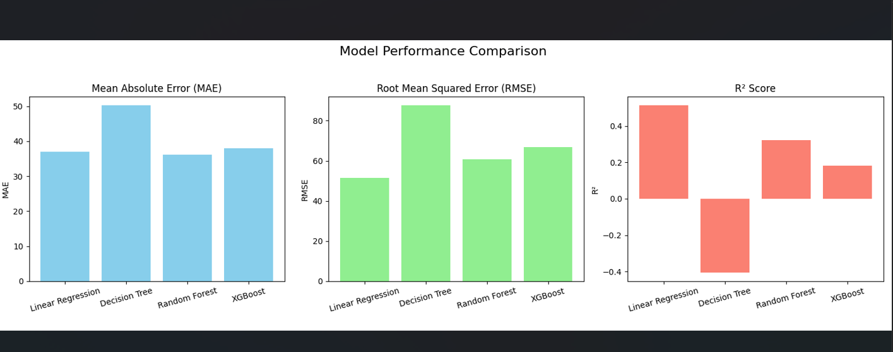

# 🏦 Loan Amount Predictor

This project is a machine learning pipeline built to predict **loan amounts** using regression techniques. It compares four models and evaluates them using multiple metrics and visualizations.

---

## ✅ Models Used
- **Linear Regression**
- **Decision Tree Regressor**
- **Random Forest Regressor**
- **XGBoost Regressor**

---

## 📊 Evaluation Metrics
- **Mean Absolute Error (MAE)**
- **Root Mean Squared Error (RMSE)**
- **R² Score**

---

## 📈 Visualizations
Bar charts are plotted to visually compare the performance of all models based on the above metrics.

---

## 🚀 How to Run

1. Clone the repository:
   ```bash
   git clone https://github.com/Dai1809/loan-amount-predictor.git
   cd loan-amount-predictor

Install the dependencies:

bash
Copy
Edit
pip install -r requirements.txt
Run the project:

bash
Copy
Edit
python loan_regression_analysis.py
📁 Dataset
Place your train_loan.csv file in the root directory. This CSV file should contain the loan application data including the LoanAmount field.

💡 Insights
📌 Based on the initial results:

Linear Regression gave the best overall performance.

Other models like Random Forest and XGBoost can be improved with hyperparameter tuning.

📸 Sample Output


🙋‍♂️ Author
Dai1809
Aspiring AI Engineer, passionate about solving business problems using ML/AI.

📌 License
This project is licensed under the MIT License.


